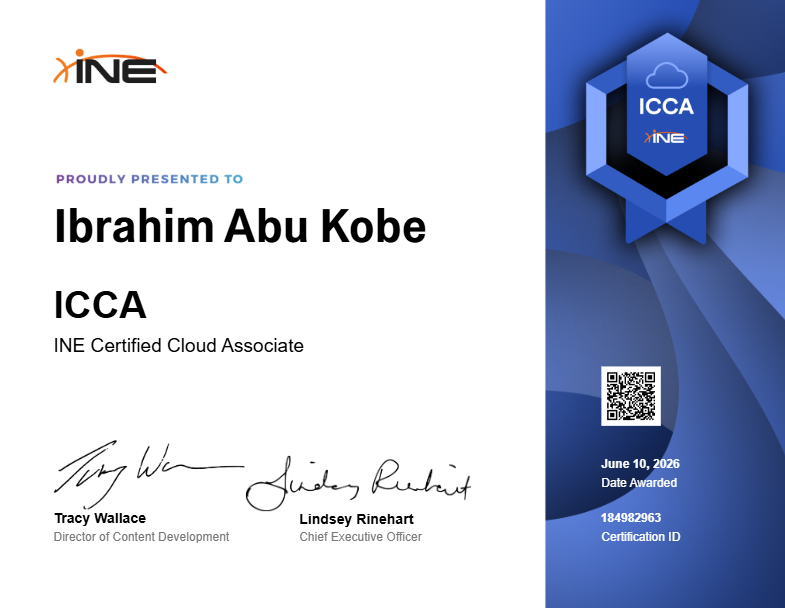

# ☁️ INE Certified Cloud Associate (ICCA)

  <!-- REPLACE "path/to/your/icca-certificate.png" WITH THE ACTUAL NAME/PATH OF YOUR IMAGE -->
  

---

## 🎯 Exam Domains & Core Competencies

### ☁️ Cloud Concepts
Focuses on the core architecture, operational benefits, and management of cloud computing environments.
*   **Cloud Management:** 🎛️ Explain and implement core cloud management concepts.
*   **Cloud Benefits:** 📈 Describe the operational and financial benefits of adopting cloud infrastructure.
*   **Monitoring & Automation:** ⚙️ Identify and utilize cloud monitoring tools and automation features to maintain system health.

### 🛠️ Cloud Services 
Covers the foundational service models that dictate how cloud resources are delivered and managed.
*   **Platform as a Service (PaaS):** 💻 Describe and deploy cloud PaaS solutions.
*   **Infrastructure as a Service (IaaS):** 🏗️ Describe and manage cloud IaaS architectures.

### 🔐 Cloud Security and Regulatory Compliance 
Addresses the critical security postures, identity management, and compliance requirements necessary to protect cloud assets.
*   **Regulatory Compliance:** 📜 Explain cloud regulatory compliance standards and governance.
*   **Infrastructure Protection:** 🛡️ Explain and implement methods for cloud infrastructure protection.
*   **Identity & Access Management (IAM):** 🔑 Explain cloud identity and access management principles.
*   **Data Protection:** 🔒 Describe cloud data protection concepts and utilize appropriate encryption tools.
*   **Identity Vulnerabilities:** 🚨 Identify cloud identity vulnerabilities and deploy protection tools to mitigate risks.

### 🧪 Practical Lab Assessment
*   **Status: PASSED** ✅
*   Demonstrated practical, hands-on ability to navigate and configure cloud environments based on real-world scenarios.

---
